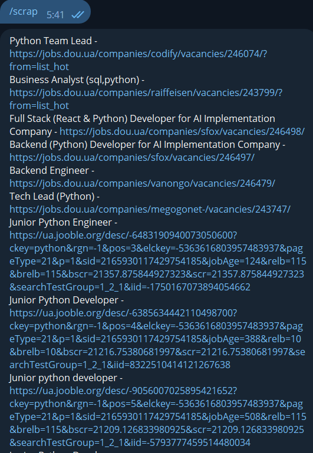

# Vacancies Parser Telegram  Bot: A Tribute to Roman Lokatir

Welcome to the Vacancies Parser Telegram  Bot, a whicn helps to monitor vacancies for python developers on 3 popular websites in Ukraine(Work.ua, Jooble.org and Jobbs.dou ) This project is designed  using Aiogram, a leading framework for the Telegram Bot API, requests  and bs4 libraries to scrap websites looking wor vacancies and Celery to optimise resources usage.

### Features

#### 1. **Scraping **:
Just user /scrap command and bot will send you
all vacancies he found on this websites wich
fits for python/backend junior/trainee developers

#### 2. **Get ID **:
This command is for people who wants to know their
telegram id to add it to .env file and recive messanges to 
or just for themselfes

### Feedback & Collaboration

If you have any questions or suggestions, please contact us:

- Developer: Email: contact.oleksandryanchar.com, ,
     [GitHub](https://github.com/OleksandrYanchar)

### Installation

#### Please remember to create and populate the .env file with any type of installation(example in the main folder:env.example)

Detailed installation information can be found in 
the [SETUP.md](SETUP.md) file.
